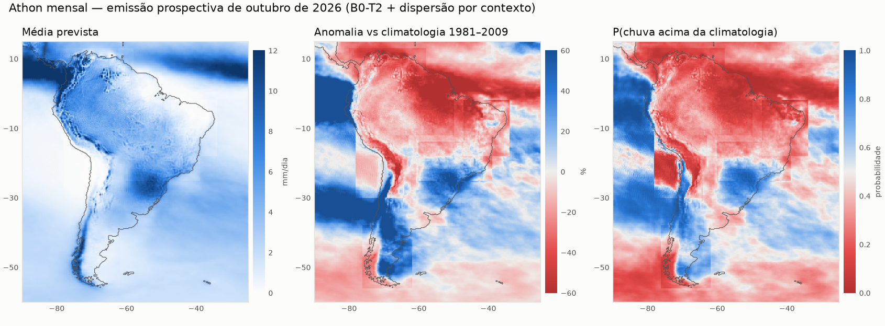
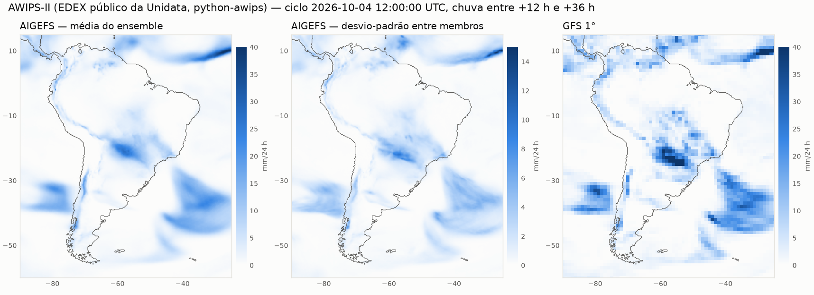

# Athon NoLimit

Previsão de precipitação sobre a América do Sul em duas escalas: **média mensal** (0,25°) e **chuva diária de D0 a D10** (0,5°).
O Athon nasceu no WorCAP 2026 (modelo S6R, 1º lugar, RMSE privado 1,57992). O NoLimit é o estudo pós-competição:
sem as restrições do concurso, com contrato operacional estrito, validação pré-registrada e confronto direto com o MONAN.

**Site:** https://brun0simoes.github.io/Athon_NoLimit/

---

### `$ athon / briefing`

```text
problema     precipitação na América do Sul (lat −60..15, lon −90..−25)
mensal       taxa média do mês T (mm/dia), grade 0,25°, alvo ERA5, emitida no dia 1 de T às 00 UTC
diário       acumulado de 24 h (12–12 UTC), D0–D10, grade 0,5°, alvo MERGE/CPTEC, rodada 00 UTC
contrato     só entram produtos já publicados no instante da emissão
produto      mensal: B0-T2 → hurdle-Gamma com dispersão por contexto → cenários Schaake
             diário: cabeça hurdle-Gamma sobre GEFS + AIGEFS → cenários Schaake; D0 com GOES
evidência    bloco cego 2025-01..2026-06, emissões prospectivas, duelo com o MONAN
```

### `❯ badges`


### `❯ fluxo`

<p align="center"></p>

**Mensal.**
1. **Insumos.** Estado ERA5T do mês T−2, CFSv2 lead 1,5, GEFS da última quarta-feira e os 51 membros do SEAS5 lead 1,5. É o que existe publicado no dia 1, às 00 UTC.
2. **Base O09M-T2.** Combinação não negativa (NNLS) de quatro membros: EOF das atmosféricas, regressão por célula, climatologia de 30 anos e CFSv2. A ela soma-se uma correção escalada do GEFS, e o resultado é truncado em zero.
3. **B0-T2.** O S6R refeito de forma causal: base + Σ W(região, estação)·cₖ, com três componentes:
   - LightGBM no resíduo;
   - ridge regional (H6);
   - MOS do SEAS5.

   Os pesos W e as penalidades são escolhidos só com anos anteriores ao bloco previsto.
4. **Distribuição.** Hurdle-Gamma com média fixa no B0-T2. A forma k e a probabilidade de mês seco p0 vêm de uma rede convolucional de contexto (M1-C).
5. **Dependência.** Os quantis de cada célula são ordenados pelos postos de campos observados passados (Schaake) ou dos membros do SEAS5 (ECC). O resultado são 51 cenários espacialmente coerentes.

<p align="center"></p>

**Diário.**
1. **Fontes.** GEFS, modelos de IA da NOAA (AIGEFS, GraphCastGFS), MONAN, GOES e climatologia MERGE 2001–2019.
2. **Agregação.** Acumulados de 6 h somados nas janelas 12–12 UTC e agregados por área na grade 0,5°.
3. **Cabeça diária.** Hurdle-Gamma por lead × região × estação: média linear nas fontes e na climatologia, p0 logístico, forma por máxima verossimilhança.
4. **D0.** GEFS 12 UTC da véspera + chuva GOES já acumulada até a emissão.
5. **Dependência.** Schaake com campos MERGE passados.

### `❯ modelos`

| Modelo | Escala | O que faz | Estado |
|---|---|---|---|
| **B0-T2** | mensal | S6R causal sobre a base O09M refeita com o estado de T−2 | baseline operacional |
| **M1-C** | mensal | dispersão da hurdle-Gamma por rede de contexto (membros zerados) | promovido |
| **Schaake / ECC** | mensal e diário | dependência espacial dos cenários | promovido |
| **M4D** | diário | cabeça hurdle-Gamma sobre o GEFS (6 anos de treino) | promovido |
| **Athon diário** | diário | mesma cabeça sobre GEFS + AIGEFS | melhor resultado diário |
| **GG0** | D0 | GEFS 12 UTC da véspera + GOES RRQPE | promovido para o dia corrente |
| M1-A | mensal | rede sobre os 51 membros do SEAS5 (DeepSets) | −0,39%, abaixo do limiar |
| M2 / SOL | mensal | solo, energia, QBO, MJO, F10.7, geometria solar | nulo |
| M3 | mensal | pré-treino em 12 membros CMIP6 | transfere, não acrescenta ao B0 |
| M4-A/C | mensal | transporte de umidade do GEFS (q·u, q·v) | ≤ 0,06% |
| M5 | 0,1° | refinamento conservativo (U-Net e flow matching) | só diagnóstico |

**Hurdle-Gamma com média fixa.** Com p0 = P(Y = 0) e Y | Y > 0 ~ Gamma(k, θ), a média é forçada a ser a do
modelo determinístico: θ = m / ((1 − p0)·k). O CRPS tem forma fechada, conferida por integração numérica, e o
treino da dispersão não altera a média.

**Por que T−2.** O estado atmosférico de T−1 só existe como ERA5T cerca de 5 dias depois do fim do mês, ou seja,
depois da emissão no dia 1. O B0 com T−1 (1,7026) é uma referência retrospectiva. O B0-T2 (1,7063) é o que pode
ser emitido de fato.

**Por que o placar da competição não se repete.** O S6R usava o SEAS5 lead 0,5, publicado depois do início do
mês. A mesma receita com lead 0,5 dá 1,5527; com o lead 1,5 disponível na emissão, 1,70. Cerca de 87% do ganho do
S6R vinha desse lead.

### `❯ resultados`

<p align="center"></p>

**Mensal** (RMSE em mm/dia, sem ponderação, grade oficial):

| Avaliação | Base T−2 | **B0-T2** | Contraste |
|---|---|---|---|
| Desenvolvimento 2013–2024 (dobras expansivas) | — | 1,7063 | B0 com proxy T−1: 1,7026 |
| **Bloco cego 2025-01..2026-06** (aberto uma vez) | 1,7523 | **1,7125** | −2,27%, IC95 < 0, 17/18 meses |
| Emissão 2026-07 (retroativa cega) | 1,672 | **1,612** | −3,6% |
| Emissão 2026-08 (retroativa cega) | 1,673 | **1,579** | −5,6% |
| Bloco cego contra MERGE (verdade alternativa) | 2,689 | **2,668** | −0,8%, IC95 < 0 |

| Probabilístico, bloco cego | Constante | **Contexto (M1-C)** | Contraste |
|---|---|---|---|
| CRPS | 0,7928 | **0,7354** | −7,24%, IC95 < 0, 18/18 meses |
| Cobertura do intervalo de 80% | 0,877 | 0,817 | alvo 0,80 |
| CRPS regional: independente × Schaake | 0,4772 | **0,3599** | −24,6% |

**Diário** (CRPS em mm/dia nas células com estação, dobras anuais 2022–2026):

| Lead | Climatologia | GEFS bruto | **M4D** | M4D vs GEFS | M4D vs climatologia |
|---|---|---|---|---|---|
| D1 | 2,225 | 2,466 | **1,880** | −23,7% | −15,5% |
| D5 | 2,249 | 2,652 | **2,063** | −22,2% | −8,3% |
| D10 | 2,217 | 2,827 | **2,179** | −22,9% | −1,7% |

| Fonte pós-processada (mesmo MOS, mesmas rodadas) | D1 | D3 | D5 | D10 |
|---|---|---|---|---|
| GraphCastGFS vs GEFS (105 rodadas, 2024-05..2026-04) | −4,6% | −6,2% | −5,3% | −2,4% |
| AIGEFS vs GEFS (96 rodadas, 2025-06..2026-10) | −4,8% | −4,2% | −3,4% | −1,2% |
| GEFS + MONAN vs GEFS (72 rodadas) | −2,0% | −3,1% | −2,1% | −1,3% |
| **D0:** GEFS 12 UTC + GOES vs GEFS 12 UTC | −7,1% | — | — | — |



### `❯ athon_vs_monan`

O MONAN é o modelo global de 10 km do INPE, operacional desde setembro de 2026. O acervo usado foi a precipitação
em grade (`dataserver.cptec.inpe.br/dataserver_dimnt/monan/monan_gam/netcdf`), lida por faixa de bytes só no
recorte da América do Sul: 72 rodadas de 26/11/2025 a 02/10/2026.

<p align="center"></p>

**Arena diária** (a casa do MONAN). O campeão do Athon é o MOS sobre GEFS + AIGEFS, sem o MONAN como entrada.
O MONAN entra bruto e corrigido pelo mesmo MOS. Os números são CRPS nas células com estação, com validação
cruzada deixando um mês de fora:

| Lead | **Athon** | MONAN corrigido | MONAN bruto | M4D | Athon vs MONAN corrigido |
|---|---|---|---|---|---|
| D1 | **1,657** | 1,757 | 3,113 | 1,728 | **−5,7%**, Athon vence |
| D3 | **1,754** | 1,845 | 3,515 | 1,834 | −5,0%, Athon vence |
| D5 | **1,882** | 1,953 | 3,964 | 1,934 | −3,6%, Athon vence |
| D7 | **1,990** | 2,078 | 4,306 | 2,054 | −4,3%, Athon vence |
| D10 | **1,913** | 1,948 | 4,481 | 1,928 | −1,8%, Athon vence |

- **Contra o MONAN corrigido:** o Athon vence em 9 de 10 leads, com empate em D9.
- **Contra o MONAN bruto:** o Athon tem metade do erro.
- **Por região, em D1:** o Athon vence nas 8 regiões, de −1,3% no oceano a −10,7% no Sul/Prata.
- **Combinação:** o MONAN acrescenta informação. O Athon com o MONAN como entrada extra melhora mais 0,7–1,4% a partir de D3.

**Arena mensal** (a casa do Athon).
- **Montagem do "MONAN mensal":** a rodada 00 UTC do dia 1 cobre os primeiros 10 dias e a climatologia completa o mês.
- **A regra favorece o MONAN:** essa rodada sai ~6h40 depois da emissão do Athon.
- **Meses:** março de 2026 ficou fora por falta de rodada.

| Verdade | Meses | **Athon (B0-T2)** | MONAN mensal | MONAN 10 dias bruto | Climatologia |
|---|---|---|---|---|---|
| ERA5 | 8 | **1,801** | 1,894 | 3,364 | 1,962 |
| MERGE | 9 | 2,603 | 2,606 | 3,549 | 2,801 |

- **Contra o ERA5:** o Athon tem RMSE 4,9% menor e vence em 7 de 8 meses. Com 8 meses, o intervalo de confiança inclui zero, então o resultado é empate estatístico, com vantagem do Athon.
- **Contra o MERGE:** empate.

### `❯ awips_ii`

O AWIPS-II é o sistema de processamento e visualização do serviço meteorológico dos EUA, distribuído pela Unidata.
Tem três componentes:
- **EDEX:** ingere por LDM, decodifica para HDF5/PostgreSQL e serve os dados.
- **CAVE:** visualização.
- **python-awips:** acesso programático aos dados.

**Uso no Athon.**
- O python-awips consulta o EDEX público (`edex-cloud.unidata.ucar.edu`).
- O painel abaixo mostra o ciclo mais recente do AIGEFS (média e espalhamento entre membros) e do GFS para as 24 h entre +12 h e +36 h, gerado por `src/site/awips_painel.py`.

**Limites medidos.**
- O EDEX público guarda poucos ciclos e serve os ensembles de IA só com média e desvio-padrão.
- O GFS servido difere do NOMADS em até 4,19 mm por 6 h no mesmo ciclo.
- Para treino e avaliação, os mesmos modelos foram lidos com membros e histórico direto do AWS Open Data NOAA EAGLE (`s3://noaa-nws-graphcastgfs-pds`).



### `❯ técnicas`

- **Contrato de emissão:** cada insumo leva instante de publicação; o alvo de um mês só entra no treino depois de publicado (ERA5T de T−2).
- **Dobras cronológicas expansivas:** cada bloco é previsto por modelo treinado com anos anteriores; penalidades e pesos por seleção interna, também cronológica.
- **Pré-registro:** o JSON de cada experimento recebe sha256 antes de qualquer métrica, e o relatório grava o hash usado.
- **Bloco cego:** 2025-01..2026-06 ficou lacrado até a avaliação única. Depois disso, confirmação só com previsões emitidas antes da verdade, prospectivas ou retroativas cegas.
- **Bootstrap por blocos:** de 6 meses, de 4 rodadas ou de 7 dias, sem cruzar segmentos não contíguos.
- **CRPS:**
  - forma fechada da hurdle-Gamma;
  - CRPS justo para ensembles finitos;
  - PIT aleatorizado e cobertura condicionada à previsão.
- **Leitura parcial de dados remotos:** só as mensagens GRIB pelo `.idx` ou pelos cabeçalhos, e só os blocos HDF5 da região.
- **Execução segura:** mutex nomeado com Job Object (o processo morto leva os filhos) e escrita atômica de todos os artefatos.

### `❯ discussões`

- **A média mensal está perto do limite das fontes testadas.** Membros, solo, energia, Sol, CMIP6 e transporte não acrescentaram ≥ 0,5% ao B0-T2. Os ganhos grandes vieram da distribuição, da dependência espacial e do diário.
- **A dispersão aprendida é específica do alvo.** Contra o ERA5, o contexto ganha 7%. Contra o MERGE, a dispersão constante é melhor (+3,6% para o contexto, 0/18 meses). A média e a dependência valem nas duas verdades.
- **Os modelos de IA são a melhor fonte para o diário.** Brutos, superam o GEFS em 8% a 14%. Um MOS de IA treinado em meses supera o M4D treinado em 6 anos de GEFS.
- **O MONAN bruto tem viés úmido**, de +0,8 a +1,8 mm/dia. Corrigido, empata com o GEFS; combinado, acrescenta 1–3%.
- **Nitidez × calibração.** A probabilidade do M4D é mais bem calibrada ponto a ponto, mas menos nítida no FSS de chuva forte que os membros do GEFS. A reordenação ECC não resolve, porque a causa está nas marginais.
- **Refinamento 0,1°.** A estrutura subgrade é aprendível com o total observado (decoder −15%). Com o total previsto, nenhum refinamento ajuda: o erro grosso domina.
- **Astronomia.**
  - A maré lunar M2 aparece na chuva horária do CMORPH (0,42% da média, p = 0,005), mas some na agregação diária.
  - Geometria e atividade solar não acrescentam nada aos produtos.
- **Limites.**
  - A confirmação prospectiva tem 2 meses avaliados.
  - Os duelos diários usam validação cruzada por mês, simétrica, mas não operacional.
  - O MONAN tem cerca de 10 meses de acervo.

### `❯ anti_vazamento`

- **Alvo ausente na emissão:** o Y do mês emitido entra como NaN; qualquer previsão não finita aborta a cadeia.
- **Integridade:** o B0 recalculado reproduz as previsões congeladas do bloco cego (diferença máxima de 3,7e-6).
- **Insumos conferidos:** os rebaixados são comparados ao acervo (CFSv2: diferença 0,0 nas origens em comum).
- **Placar fora do treino:** o placar da competição nunca foi usado para treinar ou selecionar nada.
- **Sem código alheio:** nenhum código, peso ou configuração de outras equipes.

### `❯ dados`

| Fonte | Uso | Acesso |
|---|---|---|
| ERA5 / ERA5T (mensal) | alvo mensal, estado de T−2 | Copernicus CDS |
| SEAS5 / SEAS5.1 | MOS, membros, ECC | Copernicus CDS |
| NMME CFSv2 | membro da base | IRI Data Library |
| GEFSv12 (reforecast e operacional) | base, transporte, diário | AWS `noaa-gefs-pds` |
| GraphCastGFS, AIGEFS | diário (IA) | AWS `noaa-nws-graphcastgfs-pds` |
| MONAN 10 km | duelo | CPTEC `dataserver_dimnt/monan` |
| MERGE (CPTEC) | alvo diário, sensibilidade | CPTEC FTP |
| GOES-16/19 RRQPEF | D0 | AWS `noaa-goes16/19` |
| CMORPH CDR horário | maré lunar | NOAA NCEI |
| ERA5-Land, CMIP6 | M2, M3 | CDS, Pangeo |
| AWIPS-II EDEX | painel em tempo quase real | Unidata `edex-cloud` |

### `❯ reprodução`

Ambientes:
- `.venv`: numpy, pandas, xarray, netCDF4, LightGBM, scipy, matplotlib;
- `torch_runtime`: PyTorch 2.6 cu124;
- `ecmwf_runtime`: ecCodes, h5py;
- `awips_runtime`: python-awips.

```bash
# mensal: emitir um mês novo (insumos publicados até o dia 1)
python -m src.emissao.mensal insumos --alvo 2026-11
python -m src.executa_cadeia runs/cadeia_emissao.sh runs/cadeia_emissao_202611.log 2026-11
python -m src.emissao.avalia

# diário
python -m src.data.diario_casos montar
python -m src.models.diario_m4
python -m src.verification.duelo_multimodelo

# Athon × MONAN
python -m src.verification.duelo_athon_monan diario
python -m src.verification.duelo_athon_monan mensal

# site
python -m src.site.awips_painel      # ambiente com python-awips
python -m src.site.figuras --saida docs/assets
```

Os dados brutos e os artefatos intermediários (`data/`, `runs/`) não estão no repositório. Os coletores em
`src/data/` registram URL, data de recuperação e sha256 de cada arquivo.

### `❯ estrutura`

```text
configs/
  contracts/        contratos de emissão (mensal e diário)
  experiments/      pré-registros (JSON + sha256)
src/
  data/             coletores e montagem de conjuntos
  models/           B0, M1–M5, cabeça diária, SOL
  emissao/          emissão mensal e avaliação prospectiva
  verification/     métricas, duelos, avaliações
  site/             painel AWIPS-II e figuras do site
reports/            relatórios, decisões (D-01..D-22), conclusão
tests/              causalidade, invariância, trava
baseline_frozen/    código do S6R da competição
docs/               GitHub Pages
plan.md             plano de pesquisa e apêndice de execução
```

### `❯ docs`

- [Conclusão](reports/CONCLUSAO.md)
- [Fase 3: MONAN, IA, AWIPS-II, astronomia](reports/fase3.md)
- [Produto diário e duelo por estação](reports/etapa3.md)
- [Fase 2](reports/fase2.md)
- [Bloco cego](reports/bloco_virgem.md)
- [Registro por cenário](reports/registro_final.md)
- [Decisões](reports/decisoes.md)
- [Plano](plan.md)
